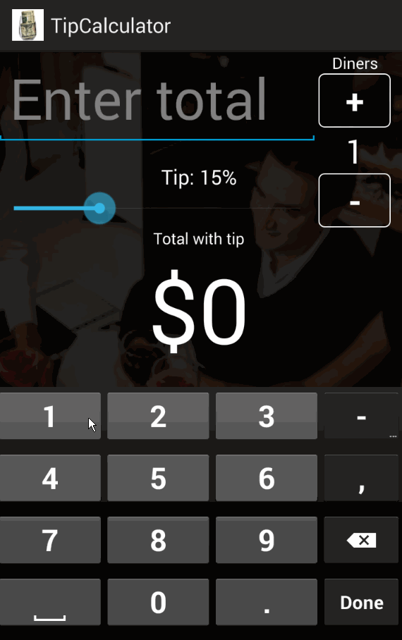

TipCalculator
=============

Basic tip calculator app for Android.
* User is displayed the tip of specified percentage for specified entered amount.
* User enters the total amount of the transaction.
* User can select any tip percentage with the seek bar.
* Upon selecting tip amount, formatted tip value is displayed .
* User can select how many ways to split the tip.
* Custom style for diners buttons.

Time spent: 5 hours.

Walkthrough
-----------

